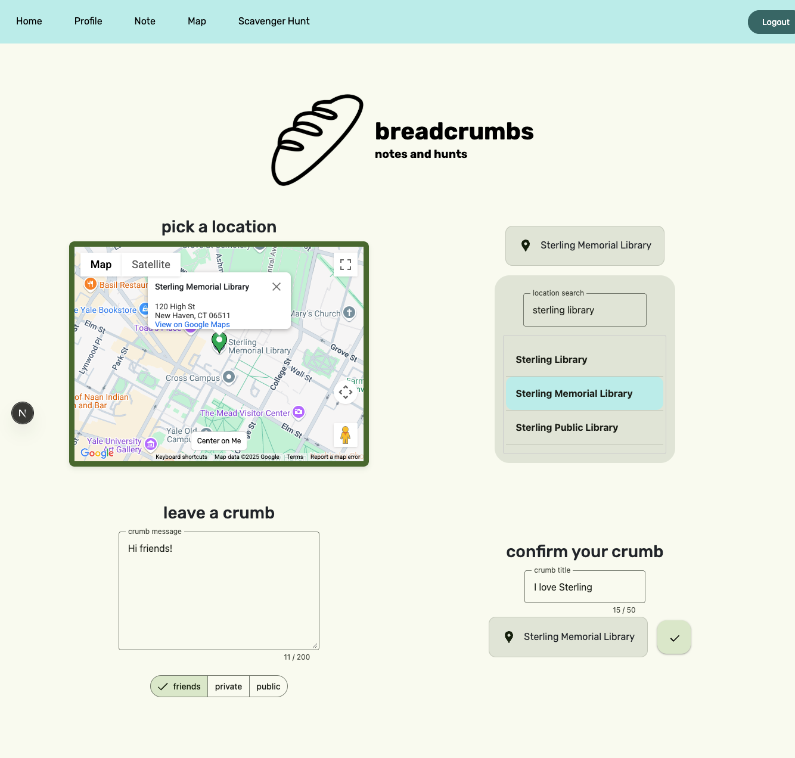
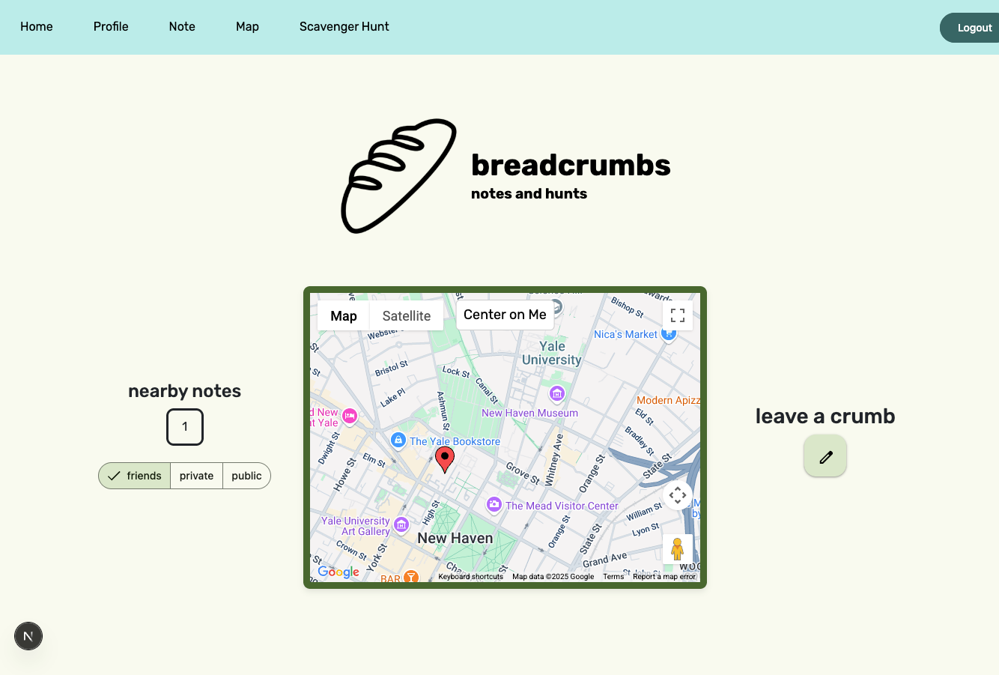
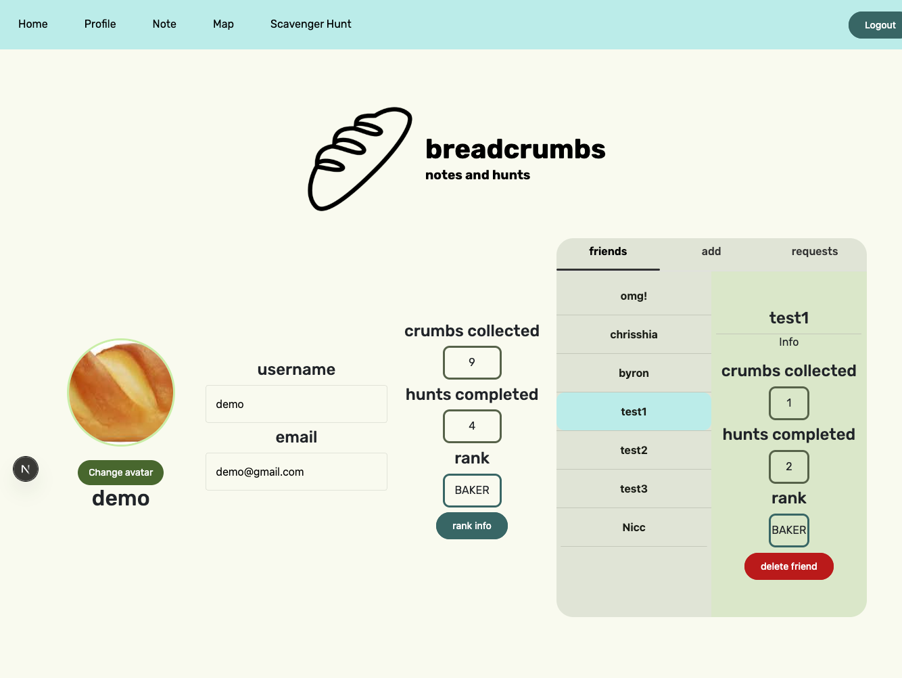
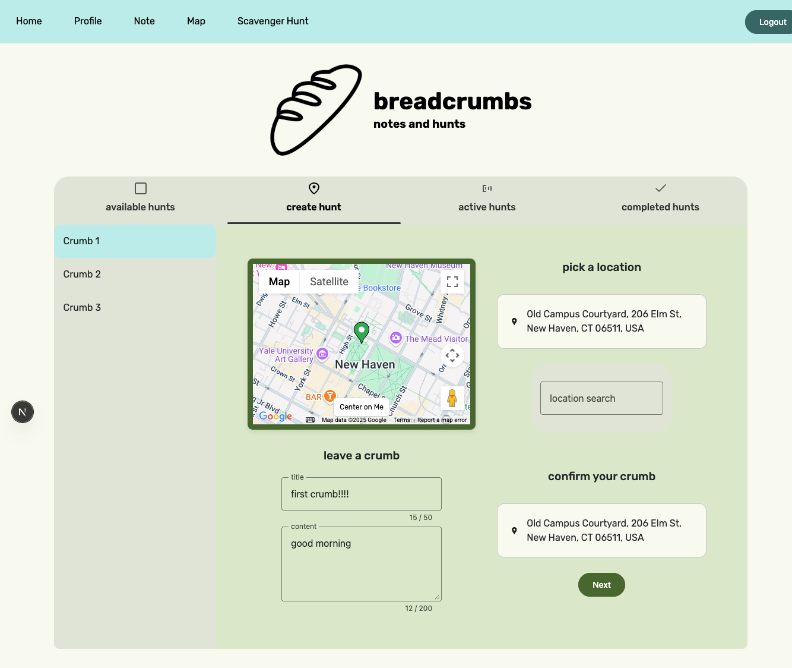
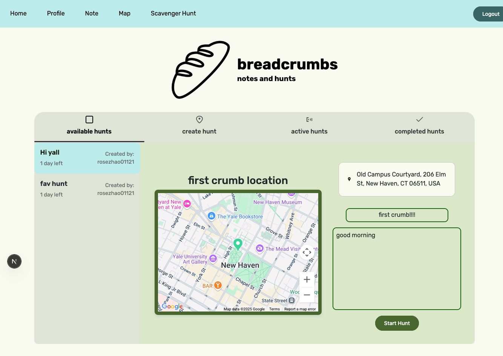
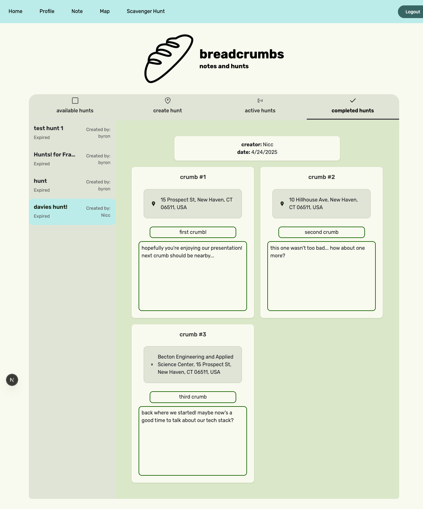

## 🥖 Breadcrumbs

**Breadcrumbs** is a full-stack web application that turns the world into a note-sharing playground. Think Pokémon Go meets Snapchat, with a sprinkle of storytelling and real-world exploration.

It allows users to leave and discover geo-tagged messages — called *crumbs* — that can only be read when physically nearby. Users can add friends, customize visibility settings, and even create multi-stage scavenger hunts. Whether you’re leaving a message for a friend or designing a trail of secrets around campus, Breadcrumbs turns geography into storytelling.

---

### 🔧 Tech Stack

- **Frontend**: React + TypeScript + CSS
- **Backend**: Next.js (TypeScript)
- **Database**: Supabase (PostgreSQL, Auth)
- **Map Integration**: Google Maps API

---

## 🔑 Key Features

#### 🗺️ Location-Based Crumbs

- Leave short, geo-tagged messages ("crumbs") at real-world locations.
- Crumbs are only viewable to users who are physically within range.
- Customize crumb visibility: **Public**, **Friends-only**, or **Private**.

#### 🗺️ Map View

- Explore nearby public, friends-only, and private crumbs.
- Filter visibility types to customize your experience.

#### 📊 Profile Page

- Displays username, email, avatar, and activity stats.
- Track your rank: **BAKER**, **CHEF**, or **MASTER** — based on completed hunts.
- See friend list and view their stats via an interactive UI.

#### 🧑‍🤝‍🧑 Social Layer

- Add friends via email-based requests.
- View friends' profile stats (crumbs collected, hunts completed, etc.).
- Accept and manage incoming friend requests.

#### 🏆 Scavenger Hunts

- Create custom trails of 3–5 crumbs that must be collected in order.
- Accept and follow hunts created by others.
- Track hunts in progress and view completed trails with all revealed messages.

  
  

---

### 🚧 Status

We are currently finalizing deployment and polishing UI/UX. 

---

### 👨‍👩‍👧‍👦 Team & Acknowledgment

This project was developed as part of a course project at Yale University for course CPSC 491/591 Full-stack Web Development.

**Contributors:**
- [Rose Zhao](https://github.com/rose-zz) 
- [Jennifer Chen](https://github.com/ChenJieNi2004) 
- [Chris Shia](https://github.com/summerhero09) 
- [Nicholas Lee](https://github.com/NicholasLee76) 
- [Jerry Huang](https://github.com/jerryhuang329) 

> 📬 Contact us if you'd like to reuse or extend this idea!

---

### ✨ Guide to Usage

0. Install source code from release and cd into 'Breadcrumbs' directory. For first time usage, run 'npm install' to install dependencies. Then, for all future uses, run 'npm run dev' and open the localhost link.
1. Login/Registration: users can create an account based on their email, with a username and password.
2. Once logged in, users can access to the rest of the functionality: note, map, and profile.
3. In the note screen, you can leave notes by searching up a location's name and selecting it, and then also writing up a
   short note and selecting a visibility option. They can then confirm the note, which will be displayed in the map.
4. In the map screen, you can see notes based on which togglable button you selected (friends, private, public) based on
   how those notes were initially set as. You can only click on the notes to read them if you are within a close radius, which
   will be indicated by the yellow pins, and the red pins are too far to read. Currently the radius is set as 0.2 miles from your current location.
   - Note: You need to enable location access on your browser for the map to find your current location. On Chrome, this is the small pin icon on the right end of your URL bar. Once you enabled location access, you may need to refresh and click "Center on me" for the map to center on your current location.
5. In the profile screen, you can look at your list of friends and delete them, add friends based on their
   email, and accept incoming requests from other users. These friends will be able to see your friends-only visibility notes.
   - In order to make testing and using this portion a little easier, we've made some dummy users for you to log in with that has populated friend lists:
     - Usernames: demo@gmail.com, test1@gmail.com, test2@gmail.com, test3@gmail.com, test4@gmail.com
     - Password (same for all): 123456789
   - Because notes and hunts expire, it is possible there are no notes or hunts when you're reading this. We encourage you all to make accounts, add each other as friends, and leave notes for each other!

